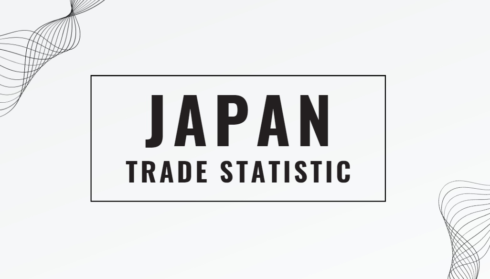
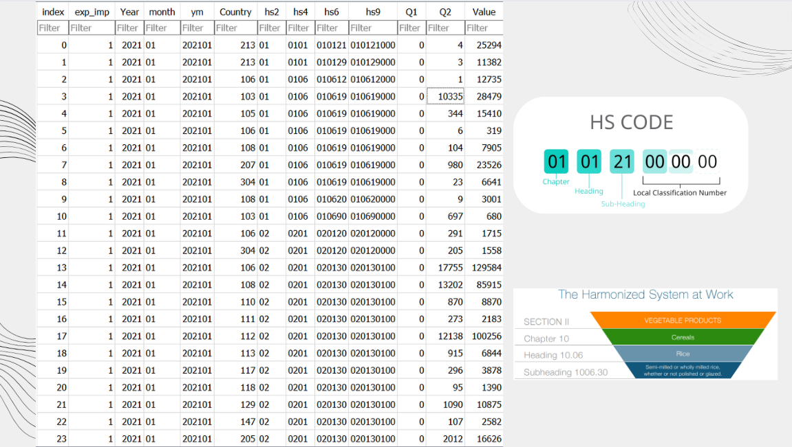

# Objectives:
* Identify Japan's main trading partners
* Explore trade pattern across industries
* Trade balance analysis
* Discover trends over time
* Research on trade dynamics by industry

# The Dataset:
* https://www.kaggle.com/datasets/zanjibar/japan-trade-statistics
* https://www.kaggle.com/datasets/khaidoox/data-hihi

# About Dataset:

